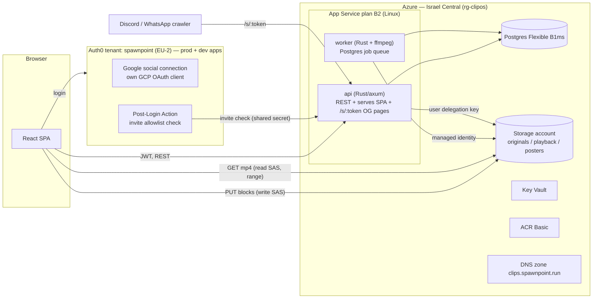
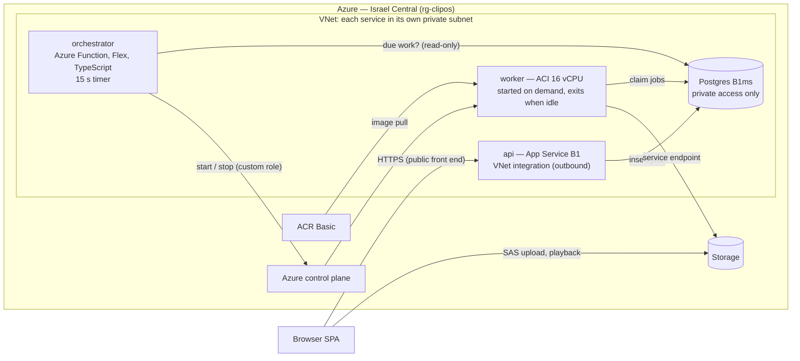

# clipos — implementation plan

Invite-only clip archive for a small group of friends (5–7 users). CS2 first; other games later.
Everything runs in **Azure Israel Central**, no Kubernetes. Backend in Rust, frontend in TypeScript.

This plan is the outcome of a design review. Every decision below was settled explicitly;
the [decision log](#decision-log) records each one and why it was made.

---

## 1. Architecture



**Principles**

- **Browsers talk to Blob Storage directly** for upload and playback (SAS scoped to one blob, short-lived). Video bytes never go through the API.
- **Managed identity everywhere.** No storage keys, no connection strings with passwords (Postgres uses Entra auth for the apps; admin password lives in Key Vault for break-glass only).
- **One deployable for web + API.** The Rust `api` serves the built SPA and injects OpenGraph tags on share routes. No Node runtime in production.
- **Postgres is the queue.** `jobs` table + `SELECT … FOR UPDATE SKIP LOCKED`. No Service Bus / Storage Queue at this scale.
- **Game-agnostic core.** `clips.game_id` + `clips.metadata jsonb`; analysers are per-game crates behind a trait, dispatched by `game_id`.

---

## 2. Repository layout

```
clipos/
├── Cargo.toml                 # cargo workspace
├── crates/
│   ├── core/                  # domain types, db (sqlx), storage/SAS, auth (JWT), job queue
│   ├── api/                   # axum server: REST, SPA static, OG share pages, internal endpoints
│   ├── worker/                # job runner: transcode, (later) analyse; exposes /healthz
│   └── analysis-cs2/          # phase 8 — killfeed CV
├── migrations/                # sqlx migrations
├── web/                       # pnpm workspace: React + Vite + TanStack Router/Query + Tailwind
│   └── src/api/generated.ts   # openapi-typescript output (from utoipa spec)
├── infra/
│   ├── bootstrap/             # tofu: state storage account + GitHub OIDC identity (applied once, locally)
│   ├── azure/                 # tofu: everything in rg-clipos
│   └── auth0/                 # tofu: auth0 provider — single tenant holding both prod and dev apps/APIs
├── deploy/
│   ├── api.Dockerfile         # multi-stage: pnpm build web → cargo build api → distroless/debian-slim
│   └── worker.Dockerfile      # cargo build worker → debian-slim + ffmpeg
├── compose.yaml               # local: postgres, azurite, api, worker
├── .github/workflows/         # ci.yml, deploy.yml, infra.yml
└── docs/
    └── PLAN.md
```

**Key crates:** `axum`, `tokio`, `sqlx` (postgres, offline mode), `utoipa` (+ `utoipa-axum`), `jsonwebtoken` (+ cached JWKS), `reqwest` + `hmac`/`sha2` for Blob Storage (no Azure SDK, decision 22), `tracing` + `tracing-subscriber` (JSON), `thiserror`/`anyhow`, `nanoid` (share tokens).
`core::storage` signs SAS URLs itself: a user delegation key (managed identity) in Azure, Azurite's shared key locally. Every blob operation, ours included, goes through a SAS scoped to one blob.

**Web:** `@auth0/auth0-react` (refresh-token rotation, in-memory cache), direct block upload with `XMLHttpRequest` (`web/src/lib/upload.ts`: 8 MiB blocks, 4 in flight, retries, progress; no Azure SDK), `@tanstack/react-router`, `@tanstack/react-query`, Tailwind, native `<video>` with custom controls (speed, frame-step, later: kill markers).

---

## 3. Data model (initial)

| Table | Columns (abridged) | Notes |
|---|---|---|
| `users` | `id uuid`, `auth0_sub unique`, `email citext unique`, `handle unique`, `display_name`, `avatar_url`, `steam_name null`, `role (admin\|member)`, `status (active\|disabled)`, timestamps | Created on first authenticated request if email is invited |
| `invites` | `email citext pk`, `invited_by`, `created_at`, `accepted_at`, `revoked_at` | Source of truth for the allowlist |
| `games` | `id text pk ('cs2')`, `name` | Seeded |
| `clips` | `id uuid`, `owner_id`, `game_id`, `title`, `description`, `map null`, `my_pov bool`, `status (uploading\|processing\|ready\|failed)`, `original_blob`, `original_bytes`, `playback_blob`, `poster_blob`, `duration_ms`, `width`, `height`, `fps`, `metadata jsonb`, `created_at`, `updated_at`, `deleted_at` | Soft delete via `deleted_at` |
| `tags` / `clip_tags` | `clip_tags(clip_id, tag_id, source (user\|auto))` | Auto tags come from analysis in phase 8 |
| `clip_players` | `(clip_id, user_id)` | "Friends in this clip" |
| `reactions` | `(clip_id, user_id, emoji)` pk | |
| `share_links` | `token text pk` (22-char nanoid), `clip_id`, `created_by`, `created_at`, `revoked_at` | One active link per clip |
| `jobs` | `id`, `kind (transcode\|analyse)`, `clip_id`, `status`, `attempts`, `run_after`, `locked_at`, `locked_by`, `last_error`, timestamps | Claimed with `FOR UPDATE SKIP LOCKED`; retries with exponential backoff, max 3 |
| `analysis_results` | `clip_id`, `analyser_version`, `raw jsonb`, `stats jsonb`, `corrected jsonb null`, `created_at` | Phase 8 |

**Blob layout** (one storage account, private containers):

- `originals/{clip_id}/{sanitized-filename}` — Hot → **Cold after 30 days** (lifecycle policy)
- `playback/{clip_id}.mp4`
- `posters/{clip_id}.jpg`
- `models/{name}/{version}/` — the killfeed detector's models (phase 8): `model.onnx`, `classes.json`, `model-card.json`, training checkpoint. Versions are never overwritten.
- Blob soft delete 14 days, container soft delete 14 days. CORS: `PUT, GET, HEAD, OPTIONS` from `https://clips.spawnpoint.run` only. Local development uses Azurite, whose CORS the api sets itself (`LOCAL_CORS_ORIGINS`); `dev_cors_origins` in `infra/azure` adds `http://localhost:5173` back while a local web build talks to Azure.

---

## 4. Key flows

### Invite & login
1. Admin adds an email on `/admin` → row in `invites` → UI shows **Copy invite link** (`https://clips.spawnpoint.run/?invite=1`). No email is sent; the admin shares the link over WhatsApp.
2. User clicks **Sign in with Google** → Auth0 (Google is the only connection).
3. Auth0 **Post-Login Action** denies any login with `email_verified` false. When the login is for the **prod** app or requests the **prod** audience, it also calls `POST /internal/invites/check` with `{"email": …}` (a body, so emails stay out of HTTP logs) and a shared secret header (Action secret ↔ Key Vault) and calls `api.access.deny()` if the email isn't invited. Logins through the dev app with the dev audience skip the remote check, because Auth0 can't reach `localhost`. The local API still enforces the allowlist.
4. SPA gets an access token (prod audience `https://clips.spawnpoint.run/api`; dev audience `http://localhost:8080/api`, so dev tokens are rejected by the prod API). The API validates RS256 via cached JWKS, then upserts `users` by `sub`. **The API enforces the allowlist too**, so the Action is defence in depth, not the only gate.
5. Bootstrap admin: `ADMIN_EMAILS` (app setting, from the GitHub secret of the same name) is seeded as active admin invites at every api start, and existing users with those emails are promoted and re-enabled. Each invite carries the role the user gets on first sign-in.
6. Disabling a user sets `status=disabled` → API returns 403 `account_disabled`. Revoking an invite also blocks sign-in (`not_invited`), even for someone who already joined. Either way their clips remain. Admins can't revoke, demote or disable themselves.

### Upload → transcode
1. `POST /api/clips` `{title, game_id, map, filename, bytes, content_type, my_pov}` → validates (≤ 2 GiB, allowed extension mp4/mkv/mov), creates clip `status=uploading`, returns a **user-delegation SAS** (create+write, that blob only, 2 h).
2. Browser uploads blocks directly to `originals/…` with progress UI.
3. `POST /api/clips/{id}/complete` → API HEADs the blob, checks size, sets `status=processing`, enqueues `transcode`.
4. Worker claims the job:
   - `ffprobe` the original via a read SAS URL (no full download needed): must have a video stream (the largest one that isn't cover art), duration ≤ 5 min (the container's, else the stream's, else measured from its packets). A header can understate it, so the output's measured length is always checked against the cap too, and ffmpeg stops writing at 307 s (`-t`). ffprobe and ffmpeg read an upload only in the formats, codecs and protocols we accept (`-format_whitelist`, `-codec_whitelist`, `-protocol_whitelist`, and `-sn -dn` on outputs), and each run has a time limit (ffmpeg 50 min, ffprobe 10).
   - `ffmpeg -i <sas-url>` → H.264 High, `-vf "scale='round(oh*dar/2)*2':'trunc(min(1080,ih)/2)*2',setsar=1,fps=60 (only above 60)"` (plus `bwdif` for interlaced sources), **source display aspect ratio preserved** (4:3 stays 4:3, anamorphic 1440×1080 becomes 1920×1080, sizes rounded to even), AAC audio, `-movflags +faststart`, CRF ~20, `-preset veryfast`, `-threads 1`, run under `nice`. Output to local temp, then upload to `playback/`.
   - Poster: frame at 50 % of the video stream's length (the first frame if that finds none) → `posters/{id}.jpg`.
   - Update clip (`ready`, duration, dimensions, fps). On failure: retry with backoff; after 3 attempts → `failed` with the error visible to the uploader. A run that crashes or hangs its worker counts too: the reaper fails the job instead of requeueing it a fourth time ("processing kept crashing"), and a late result from a requeued run is dropped. A running job's lock (`jobs.locked_at`) is refreshed every 3 min, so the reaper only requeues a job whose worker stopped, never a long one still going.
5. Janitor (inside worker, hourly): delete `uploading` clips older than 24 h (with their blobs); hard-delete clips with `deleted_at` older than 7 days (DB rows + blobs).

### Playback
- `GET /api/clips/{id}` returns `playback_url` and `poster_url` as read SAS (2 h). The API caches the user delegation key (refreshed daily), so signing needs no network call.
- `GET /api/clips/{id}/download` → 302 to a read SAS for the original with `Content-Disposition: attachment`.

### Public share links
- Uploader (or admin) toggles **Share** → creates `share_links` row; revoking sets `revoked_at`.
- `GET /s/{token}` (no auth): the API serves `index.html` with injected tags — `og:type=video.other`, `og:title`, `og:image=/s/{token}/poster.jpg`, `og:video=/s/{token}/video.mp4`, `og:video:type=video/mp4`, width/height, `twitter:card=player` with `twitter:player:stream` (Discord wants the player card next to `og:video`). The SPA renders a minimal public player.
- `GET /s/{token}/video.mp4` and `/poster.jpg` → **streamed from Blob Storage through the api** (200/206 with byte ranges, HEAD supported), so the URLs in embeds never expire. Not 302s: Discord's unfurler doesn't reliably follow redirects and then shows no embed at all (decision 26). Revoked/deleted → 404.
- Rate-limit `/s/*` per client: in-process token buckets keyed on the last `X-Forwarded-For` entry (App Service appends the real client; an IPv6 client counts by its /64), no extra crate. The page and `clip.json` allow `SHARE_RATE_PER_MINUTE` (default 120) per client. The video and poster stream whole files, so they have their own, lower limit, `SHARE_MEDIA_RATE_PER_MINUTE` (default 30) per client, and a cap per link from everyone together, `SHARE_LINK_MEDIA_RATE_PER_MINUTE` (default 120). Each limiter keeps two generations of up to 10,000 clients and drops the older one whole, so the map stays bounded without scanning it.

---

## 5. API surface (v1)

```
GET    /healthz
GET    /api/me                         PATCH /api/me  (display_name, handle, steam_name)
GET    /api/users/{handle}             (profile + their clips)
GET    /api/clips?game=&map=&uploader=&tag=&player=&sort=new|top&cursor=
POST   /api/clips                      → {clip, upload_url}
POST   /api/clips/{id}/complete
GET    /api/clips/{id}                 PATCH /api/clips/{id}   DELETE /api/clips/{id}
GET    /api/clips/{id}/download        (→ {url}: read SAS that downloads with the file name)
PUT    /api/clips/{id}/reactions/{emoji}   DELETE same
PATCH  /api/clips/{id}                 (title, description, map, myPov, tags, players)
POST   /api/clips/{id}/share           DELETE /api/clips/{id}/share
POST   /api/clips/{id}/complete        POST /api/clips/{id}/retry   POST /api/clips/{id}/restore
GET    /api/me/trash                   GET /api/users  (members, no emails)
GET    /api/tags                       (autocomplete)
GET    /api/admin/invites              POST /api/admin/invites   POST /api/admin/invites/revoke  (email in body)
GET    /api/admin/users                PATCH /api/admin/users/{id}  (role, status)
POST   /internal/invites/check         (Auth0 Action only; shared-secret header; email in body)
GET    /s/{token}  /s/{token}/video.mp4  /s/{token}/poster.jpg
GET    /*                              (SPA fallback)
```

OpenAPI generated by `utoipa`; `pnpm gen:api` runs `openapi-typescript` → `web/src/api/generated.ts`. CI fails if the generated file is stale.

---

## 6. Infrastructure (OpenTofu)

All in resource group `rg-clipos`, region `israelcentral`.

| Resource | SKU / config |
|---|---|
| App Service plan | Linux **B2** (2 cores, 3.5 GB); P1v3 until the 2026-10-03 cost audit (decision 45) |
| Web App `clipos-api` | custom container from ACR, system-assigned MI, Always On, health check `/healthz`, custom domain `clips.spawnpoint.run` + **free App Service managed certificate** |
| Web App `clipos-worker` | custom container, system-assigned MI, **Always On**, health check `/healthz`. The worker must listen on HTTP (`WEBSITES_PORT`), because App Service treats a container that doesn't answer on its port as failed. Both apps' Kudu (SCM) sites deny everyone but `scm_allowed_ips` (default none): deploys go through ARM and logs to Log Analytics |
| Postgres Flexible Server | Burstable **B1ms**, 32 GB auto-grow, PG 17, 7-day PITR, no HA, custom maintenance window (Sun 04:00 IL). **Entra-only auth** (password auth off). Public endpoint with **firewall = App Service outbound IPs only** (from `possible_outbound_ip_address_list`), no "allow Azure services" rule; an admin IP rule is added only while needed. Those IPs are shared with other apps on the stamp, so connection throttling is on |
| Storage account | StorageV2, LRS, private containers, lifecycle policy, soft delete, CORS |
| Key Vault | RBAC mode; secrets: Auth0 Action shared secret (phase 3). No database password: Postgres is Entra-only |
| ACR | Basic; `AcrPull` for both web apps' MIs |
| DNS zone | `clips.spawnpoint.run` — A record + `asuid` TXT for App Service domain verification |
| Log Analytics + diagnostic settings | App Service console logs, Postgres logs (connection lines on, since only they carry a failed login's client address; disconnection lines off); 30-day retention, 0.1 GB daily cap |
| Action group + alerts | `ag-clipos-admins` mails `ADMIN_EMAILS`. `clipos-postgres-failed-connections`: more than 10 failed Postgres logins in 15 minutes (a platform metric, so it still fires when the Log Analytics cap pauses ingestion). Still to add (phase 7): worker job failures, 5xx rate, Postgres CPU/storage |
| Budget | `clipos-monthly` on `rg-clipos`, $75: mails at 80% and 100% actual and 100% forecast |
| ACR task | `purge-old-tags`, weekly: keeps the last 10 tags per image |

**Role assignments:** `api` MI → `Storage Blob Delegator` (account) + `Storage Blob Data Reader` (playback/posters) + `Storage Blob Data Contributor` (originals, for deletes) + `Key Vault Secrets User`; `worker` MI → `Storage Blob Delegator` (account, to sign read SAS for ffmpeg) + `Storage Blob Data Contributor` (originals/playback/posters) + `Storage Blob Data Reader` (models, so it can't overwrite them), and no Key Vault role, since it reads no secret; both → `AcrPull`, Postgres Entra role.

**State:** `infra/bootstrap` creates `rg-clipos-tfstate` + storage account with blob versioning; applied locally once. Other stacks use the `azurerm` backend with `use_azuread_auth = true`.

**Auth0 (`infra/auth0`, auth0 provider): existing tenant `spawnpoint` (EU-2, domain `spawnpoint.eu.auth0.com`)**, because the account can only have one tenant. It holds:
- **Two SPA applications:** `clipos-web` (callbacks and origins only `https://clips.spawnpoint.run`) and `clipos-web-dev` (only `http://localhost:5173`).
- **Two APIs:** prod audience `https://clips.spawnpoint.run/api` and dev audience `http://localhost:8080/api`.
- **One Google connection**, using your own GCP OAuth client and enabled for both SPAs. Database and passwordless connections are disabled.
- **The Post-Login Action and its secret.** The Action treats a login as prod when it comes through the prod app or asks for the prod audience.
- **Refresh-token rotation** on both SPAs.

Because both apps share the tenant, they share user records too. The Auth0 stack is applied from CI only, through the manually triggered infra workflow.

**Monthly cost** (measured in the 2026-10-03 cost audit): App Service B2 ≈ $29 · Postgres B1ms + 32 GB ≈ $21 · ACR Basic ≈ $5 · Storage + egress ≈ $3 · Log Analytics, DNS, Key Vault ≈ $1 → **≈ $60/month** (was ≈ $140 on P1v3).

---

## 7. CI/CD (GitHub Actions, OIDC to Azure)

- **`ci.yml`** (PRs): `cargo fmt --check`, `clippy -D warnings`, `cargo test` (Postgres service container), `cargo sqlx prepare --check`; `pnpm lint`, `typecheck`, `test`, `build`; generated-API staleness check; `tofu fmt -check` (plans are `infra.yml`'s).
- **`deploy.yml`** (CD: a merge to `main` that touches the app, after `gate.yml` confirms the PR came from this repo and its gates tested exactly this code; or by hand): build both binaries and the SPA in a job with no Azure access → wrap them in the `api` and `worker` images and push to ACR tagged with the git SHA → `az webapp config container set` for both apps → wait for `/healthz`. Migrations run at `api` startup (`sqlx::migrate!`, which takes an advisory lock); the worker waits until the schema version matches before claiming jobs.
- **`infra.yml`**: `tofu plan` on pull requests from this repo's branches touching `infra/`, which is the review. Logs and comments are public, so the plan stays on the runner: the PR comment carries only tofu's `Plan:` line and each changed resource's address and action (`.github/plan-summary.jq`), with no attribute values; run `tofu plan` locally for the details. A merge to `main` applies the stacks it changed, after `gate.yml` confirms the PR's gates tested exactly this code, and **refuses any plan that destroys or replaces a resource**; those, and any override, apply via manual `workflow_dispatch` on `main` (decided 2026-10-03, replacing the manual-only applies; see docs/quality-checkpoint.md). Web app `image` attributes use `lifecycle { ignore_changes }` so infra applies and app deploys don't fight.
- Federated credentials (created by `infra/bootstrap`, subjects in GitHub's ID-based format, decision 21): `id-clipos-github-plan` trusts pull requests (custom role `clipos plan reader` on `rg-clipos`: Reader plus `Microsoft.Web/sites/config/list/action`, because azurerm reads web app settings through it; Storage Blob Data Reader on the state container, so a pull request can't change state, and plans run `tofu plan -lock=false` because the lease is a write; Key Vault Secrets User on the app's vault, because plans refresh the invite-check secret); `id-clipos-github-deploy` trusts `main` (Contributor on `rg-clipos` + RBAC Administrator restricted by condition to 6 data-plane roles). Workflows pick one via `AZURE_CLIENT_ID_PLAN` / `AZURE_CLIENT_ID_DEPLOY`. These, `AZURE_TENANT_ID`, `AZURE_SUBSCRIPTION_ID`, `ADMIN_EMAILS`, `ADMIN_USER` (`infra/azure`'s `admin_user`), `AUTH0_CLIENT_ID`, `AUTH0_CLIENT_SECRET` and `GOOGLE_CLIENT_SECRET` are repository secrets, so the runner masks them in logs; only `AUTH0_DOMAIN` and `GOOGLE_CLIENT_ID`, which are public anyway, are variables. Every workflow starts with no token permissions and grants each job only what it needs, and secrets reach only the steps that use them.
- Actions are pinned to commit SHAs and CI's service images by digest; Dependabot (`.github/dependabot.yml`) proposes updates weekly. **`audit.yml`** (Mondays and by hand): `cargo deny` advisories, `pnpm audit`, and a Trivy scan of the Debian packages in both images.

---

## 8. Local development

`docker compose up` → Postgres 17, Azurite (blob), `api` on :8080, `worker`; `pnpm dev` (Vite on :5173, proxies `/api` and `/s` to :8080).
Auth goes through the **`clipos-web-dev`** app and the dev audience in the same tenant. Only that app allows localhost callbacks. Its client ID is public, so local dev needs no Auth0 secrets. Storage uses the Azurite connection string locally and managed identity in Azure, selected via config. `just`/`make` targets: `dev`, `test`, `gen-api`, `migrate`, `seed` (sample users/clips).

---

## 9. Phases

Each phase ends with something working that can be demoed. Deploy to production from phase 2 onwards.

### Phase 0 — Bootstrap (you, ~1 hour of clicking)
- [x] Auth0 tenant `spawnpoint` (EU-2, Production tag) already exists; M2M app `clipos-opentofu` created with Management API scopes (credentials in repo secrets).
- [x] Existing `google-oauth2` connection is `con_Q83Zo52QuJsQAQDF`. `infra/auth0` adopts it with an `import` block rather than creating a new one.
- [ ] Google Cloud: OAuth consent screen (External, scopes `openid email profile` only, so no Google verification needed, published "In production") and **one** OAuth client with redirect `https://spawnpoint.eu.auth0.com/login/callback`.
- [x] Repo `ChefControl/clipos` is **private** (GitHub Free: no environments, 2,000 Actions min/month).
- [ ] Repository secrets `AUTH0_CLIENT_ID`, `AUTH0_CLIENT_SECRET`, `GOOGLE_CLIENT_SECRET`, `ADMIN_EMAILS`, `ADMIN_USER`; variables `AUTH0_DOMAIN`, `GOOGLE_CLIENT_ID`; after bootstrap the secrets `AZURE_TENANT_ID`, `AZURE_SUBSCRIPTION_ID`, `AZURE_CLIENT_ID_PLAN`, `AZURE_CLIENT_ID_DEPLOY` (`infra/bootstrap/README.md`).
- [ ] Apply `infra/bootstrap` locally.

### Phase 1 — Walking skeleton (local)
- [x] Cargo + pnpm workspaces, `compose.yaml`, Dockerfiles, CI workflow.
- [x] `api`: `/healthz`, serves SPA, sqlx migrations, config loading, JSON tracing.
- [x] `worker`: `/healthz`, job-claim loop (no-op job), graceful shutdown.
- [x] `web`: shell layout, router, Auth0 login through the `clipos-web-dev` app, `/api/me`.
- [x] `infra/auth0` stack (both apps, both APIs, Google connection, Action) and `infra.yml` workflow.
- [x] Apply `infra/auth0` (workflow dispatch on `main`) so local login works.
- [x] **Exit:** log in locally with Google through the dev app and see your profile (2026-10-01).

Notes from implementation:
- Rust 1.98 (sqlx 0.9 needs ≥ 1.94). TypeScript pinned to 6.x because `openapi-typescript` needs the JS compiler API that TypeScript 7 (native) doesn't expose.
- SQL uses runtime-checked `query_as` (sqlx 0.9 requires `&'static str` SQL) instead of compile-time macros, so builds don't need a database. DB behaviour is covered by `sqlx::test` suites instead.
- The SPA keeps rotating refresh tokens in `localStorage`. Without an Auth0 custom domain, silent auth relies on third-party cookies that browsers block. Tightened by CSP in phase 7, and could move to memory storage if we add a custom domain (`auth.spawnpoint.run`).
- APIs use `require_client_grant`: only `clipos-web` can get prod tokens, only `clipos-web-dev` dev tokens.
- The tenant's post-login flow had a leftover Action from an earlier project that denied every other login (`not authorized for this session`); it was removed by hand. Check the flow if logins fail with that message.

### Phase 2 — Infrastructure & first deploy
- [x] `infra/azure` stack (App Service plan + `api`/`worker`, Postgres, Storage, Key Vault, ACR, Log Analytics, DNS zone); add it to `infra.yml`; new `deploy.yml` (build images → ACR → database roles → App Service, then wait for `/healthz` to report the git SHA).
- [x] Postgres per decision 19: Entra-only, firewall from App Service outbound IPs. **Two Entra admins** (you + `id-clipos-github-deploy`) instead of a group, because CI has no Microsoft Graph rights to manage groups. `deploy/db/bootstrap.sh` (in `infra.yml` after each Azure apply since 2026-10-02, before that in `deploy.yml`; the runner's IP let through the firewall for the run) creates the `clipos` database and the `clipos-api` / `clipos-worker` roles with `pgaadauth_create_principal_with_oid`, by object ID so the server needs no Entra lookups. `clipos-api` gets `CREATE` on `public`, so it owns the tables it migrates, and grants `clipos-worker` read/write at startup (`DB_WORKER_ROLE`).
- [x] `core::db`: `DATABASE_AUTH=entra` connects with a managed-identity token (`core::azure`; Azure CLI login off App Service) and swaps a fresh one into the pool 15 min before expiry via `Pool::set_connect_options`. Local dev keeps the password URL.
- [x] `id-clipos-github-plan`: custom role `clipos plan reader` = Reader + `Microsoft.Web/sites/config/list/action` (the first PR plan after the apply failed without it: azurerm reads web app settings via POST). Grant more only when a real plan fails.
- [x] Public `/privacy` page, a short plain-language policy served without login. Google requires it because the consent screen's privacy-policy URL (`https://clips.spawnpoint.run/privacy`) and homepage URL were needed to publish the app.
- [x] Applied: `infra/azure` (twice; the second run added the firewall rules and the custom domain), `infra/bootstrap` (plan reader role).
- [x] DNS: Namecheap NS records for host `clips` → the Azure zone; custom domain and managed certificate bound by `infra/azure`.
- [x] First `deploy.yml` run (2026-10-01): both apps serve `main` behind `https://clips.spawnpoint.run`.
- **Exit:** `https://clips.spawnpoint.run` serves the skeleton with a valid cert; you can log in with Google through the prod app. ✅ 2026-10-01

### Phase 3 — Invites, users, roles
- [x] `invites` + admin UI (add, revoke, copy link), `ADMIN_EMAILS` bootstrap (GitHub secret → app setting).
- [x] `/internal/invites/check` (shared secret generated by `infra/azure`, read by the api through a Key Vault reference); API-side allowlist enforcement on every request (`CurrentUser`); disable user.
- [x] Post-Login Action calls the check for prod logins; fails closed if the check errors (`infra/auth0` reads the secret from the azure state, so it was applied after the azure stack).
- [x] Google connection sends `prompt=select_account`, so "Sign out" → sign in can switch Google accounts.
- [x] Profile edit (display name, handle, Steam name).
- **Exit:** an invited friend can log in; a non-invited Google account is denied at Auth0 **and** at the API. ✅ 2026-10-01 (non-invited account refused on the Auth0 sign-in page; API refusal covered by tests and live since #8)

### Phase 4 — Upload & transcode pipeline
- [x] Upload endpoints (`POST /api/clips`, `/complete`, `/retry`, `GET /api/clips[/{id}]`), write-SAS issuing, direct block upload with progress, idempotent complete.
- [x] Worker transcode job (ffprobe + ffmpeg straight from a read SAS, 1080p/60 cap, aspect kept, poster), retries, permanent failures for bad input, failure shown to the uploader; janitor for abandoned uploads. Verified locally end to end (Azurite, browser upload → 1440p144 HEVC → 1080p60 H.264 plays in the clip page).
- [x] Upload page, clip page (player, processing / failed + retry), feed cards with posters.
- [x] **Spike, first real run on P1v3 (2026-10-01):** a friend's 30 s 1920×1080 60 fps H.264 ShadowPlay clip (58 MB, ~15 Mbps). Managed-identity SAS signing, ffmpeg reading straight from the SAS URL and the container temp disk all worked. Full transcode with 1 thread / `veryfast`: 70.5 s (0.43× real time), 36 MB out; plan CPU 19–63 % during it. Changes: `FFMPEG_THREADS=2`, and a **remux fast path** (decision 25) for files that already play everywhere.
- **Exit:** upload ShadowPlay, Medal, OBS and 4:3 clips; all play in Chrome, Safari and mobile.

### Phase 5 — Archive & social
- [x] Feed (new / top), clip page, profile pages (`/u/{handle}`: uploads, featured in, trash), filters (game, map, uploader, tag, player) in the URL, cursor pagination with infinite scroll.
- [x] Edit title/description/map/tags/players (uploader or admin); reactions (🔥 😂 💀 🐐 😮 👏); soft delete + restore within 7 days, then the janitor purges blobs and row; download original.
- [x] Player: speed (0.25–2×), frame-step, keyboard shortcuts (space/K, ←/→, `,`/`.`, `[`/`]`, M, F, 0–9).
- **Exit:** the group uses it for a week without you touching the database.

### Phase 6 — Public share links
- [x] Share toggle (uploader or admin; one live link per clip), `/s/:token` OG rendering, media endpoints that stream the blob through the api with byte ranges (`/s/:token/video.mp4`, `/poster.jpg`; they were 302s to a fresh SAS until decision 26), public player page (`/s/:token/clip.json`), per-client token-bucket rate limits on `/s/*`: `SHARE_RATE_PER_MINUTE` (default 120) for the page and `clip.json`; `SHARE_MEDIA_RATE_PER_MINUTE` (default 30) per client plus `SHARE_LINK_MEDIA_RATE_PER_MINUTE` (default 120) per link for the video and poster.
- **Exit:** a pasted link shows an inline playable video in Discord and a preview in WhatsApp; revoking the link kills the embed. ✅ 2026-10-01 (Discord inline video after decision 26)

### Phase 6.5 — Mobile UI pass + phone regression tests
Found on a phone (iPhone Safari, 2026-10-01): the clip page and header break at ~390 px.
- [x] Header: nav + avatar + "Sign out" overflow; "Sign out" wraps and is cut off. Under `sm`: logo icon, tighter nav, avatar only; "Sign out" moves to your profile page.
- [x] Clip page: long unbroken titles (Medal names files like `MedalTVCounterStrike220250408…`) run off the screen; they now break anywhere, and new uploads get readable default titles from Medal/ShadowPlay/OBS file names ("Counter-Strike 2 · 2025-04-08 18:51").
- [x] Clip page: Download / Edit / Delete overlap the title; they stack under the title on narrow screens.
- [x] Clip page: the meta line (uploader · time · length · 1080p60) collapses to one word per line because the title column is squeezed.
- [x] Sweep every page at 360–430 px: sign-in, feed + filters, upload, clip (long title, many tags/players, share panel), profile, admin, public share page, privacy. The tests found and fixed: 20 px tap targets (Privacy link, admin Revoke/Re-invite/Disable/Enable, POV checkbox labels), 22 px selects on iOS, a long email pushing `/me` sideways, the profile handle squeezed by its buttons, the public page title overflowing.
- [x] **Phone regression tests** (`pnpm e2e`, CI job `phone`): Playwright on iPhone 13 (WebKit) and Pixel 7 (Chromium) against the `e2e` build (Auth0 stubbed via a Vite alias, API mocked with route interception and deliberately awkward fixtures). Per page: no sideways scroll, nothing off screen or overflowing its box, no overlapping controls, tap targets ≥ 24 px (WCAG 2.5.8). Full-page screenshots of every page are uploaded as a CI artifact instead of pixel-diffed (fonts differ between macOS and the Linux runners).
- **Exit:** every page passes the phone suite; the clip page from the bug screenshot looks right on an iPhone.

- [x] **Worker reads originals from local disk:** a 3-minute 1080p60 Medal clip (345 MB) took the remux path but needed **427 s**, because ffmpeg reading an MP4 with its index at the end over HTTP re-opens the connection on every seek (~0.8 MB/s). The worker now downloads the original in one streamed GET when the temp disk has room (2× the original + 512 MiB, checked with `df`; free space is logged at startup) and falls back to reading over HTTP otherwise.

### Phase 8 — CS2 killfeed analysis (moved ahead of phase 7 on 2026-10-01)
- [x] **Read access for development:** your own Entra account (`admin_user` in `infra/azure`) gets Storage Blob Data Reader on the media storage account, so originals can be pulled to `~/clipos-samples/` (outside the repo) to build and label against.
- [x] **Test set:** the 4 clips the group uploaded (16:9 1080p60 Mirage and Inferno, 4:3 1280×960 at 120 fps, one re-upload), labelled kill by kill in JSON sidecars (`~/clipos-samples/labels/`), plus the Roboflow "Cs2 kill feed" set (CC BY 4.0, ~9,000 boxed real rows from many resolutions and HUDs). Still to record: 1440p, 4:3 stretched to 16:9, other HUD scales.
- [x] **Finding rows:** a small RF-DETR model (decision 27) boxes every row in the killfeed corner (top half, 0.75 × height wide from the right), at any resolution, HUD scale or background: 99.9% mAP@50 on held-out frames. Two rules from the data drop look-alikes (banners, the MVP card, street signs): rows are right-aligned and 3–11% of the corner's height.
- [x] **Whose row:** a red outline is the recording player's kill, a dark red fill their death. Checked on pixels, no names read. Only analysed when `my_pov = true`.
- [x] **Reading rows:** a second RF-DETR model finds the weapon and modifier icons (headshot, wallbang, through smoke, noscope, blind, in air; also flash assist, domination, revenge) in the frame's rows, stacked into one sheet. Trained only on rows drawn by the generator in the separate training repo from CS2's own icons, font and layout. On real rows: 23/23 on the labelled clips, right on all 30 disagreements with the earlier template reader that you judged; weak only on rows faded almost to nothing. Weapons under 0.5 confidence are left out.
- [x] **One kill per row:** a tracker follows rows across frames (they persist for seconds and move up) and records each kill's first appearance.
- [x] **Model storage:** trained models live in the media storage account under `models/{name}/{version}/` (`killfeed-rows`, `killfeed-icons`), each with a `model-card.json` (SHA-256 per file, metrics, the training repo tag, data and licences) and the checkpoint for fine-tuning. Versions are never overwritten. The worker downloads the version its config names and checks the SHA-256; it can only read the `models` container; `admin_user` has write on the `models` container only, to publish from your machine. A private Hugging Face repo keeps an archive copy.
- [x] **`analyse` job** after `transcode` for CS2 clips from the uploader's point of view: samples the original at 1 fps (the labelled clips score the same at 2, 1 and 0.5 fps; 1 fps halves the time and still sees each row about five times), stores every kill and the player's summary (kills, deaths, `2k`–`ace`, weapons, modifiers) in `analysis_results`. Models come from the `models` container, checked against their model cards. **Shadow mode:** nothing is shown or tagged yet.
- [x] **Show it** (checked first on the group's 3 clips and 1 local run, all right): the clip page's v2 layout (mocked against Medal and Allstar and video-UX research): the player beside a killfeed panel on wide screens, title and tags under it, more of the uploader's clips below. The player is Media Chrome (Mux; Vidstack is superseded by Video.js 10, too new) with the kills marked on its timeline (yours red, your deaths CS2's skull, others white), previous/next kill, theater mode, and YouTube's shortcuts plus `[`/`]` for kills. The panel: your stats (multi-kill, kills, deaths, headshots, weapons, modifiers with CS2's own icons) and every kill as CS2 draws it, clickable. Auto-tags (`2k`–`ace`, `hs`, `wallbang`, `smoke-kill`, `noscope`, `blind-kill`, `air-kill`; no weapon tags) as `clip_tags` with `source = 'auto'`, shown apart from the uploader's own and filterable like them; the multi-kill as a badge on feed cards. `GET /api/clips/{id}/analysis`.
- [ ] **Uploader corrections:** remove a wrong kill, fix a weapon or modifier, add a missed one (`analysis_results.corrected`); corrections also grow the test set.
- [x] **Training lives in its own private repo**: the generator, training and publish scripts, CS2's icon SVGs, and the eval tools (which build against this repo's `crates/killfeed`, so they test what production runs), with tags for the code each model version was trained with. Its data (the Roboflow set, the cropped rows, the generated sheets, the clip labels) is a private Hugging Face dataset. clipos keeps only what the worker runs.
- [ ] **Next training round:** much fainter rows in the generator, 16–32 data workers and validation every 5 rounds.
- [x] **Faster CI and builds:** CI took 2.5–3 min on every change and Deploy 7–9 min, nearly all of it each image compiling every Rust dependency from scratch. Now Deploy builds both binaries and the SPA once on the runner with warm caches and the images only copy them in (the Dockerfiles still build from source locally), and the database bootstrap moved to the Infra workflow (after each Azure apply), where the apps' identities can actually change; it now also re-points existing roles at recreated identities. CI skips the jobs a change can't affect (docs or infra changes skip Rust and the browsers), overlaps Postgres, Azurite and ffmpeg with compiling the tests, and runs the phone tests in Playwright's image, one job per phone: **116 s** with warm caches for a change that runs everything (was ~180 s), seconds for docs.

### Phase 7 — Hardening & launch
- [ ] Alerts, log queries, Postgres restore drill (PITR to a scratch server), blob soft-delete restore drill.
- [ ] Security pass: SAS scopes/expiry, CORS, internal endpoint secret. (Headers — CSP, HSTS, nosniff, referrer and permissions policies — and the dependency audits, `cargo deny` and `pnpm audit`, were done in S1.)
- [ ] Invite everyone. 🎉
- [ ] **Old infrastructure teardown:** finish removing an earlier project's leftovers by hand (the checklist is kept outside this repo).

### Redesign: "the show"
The archive gains a show night: the group opens the show on clipos, every browser plays tonight's clips at full quality in sync with the host, and they talk in Discord voice. Friends react, ask for replays and add clips; a finale vote picks clip and fail of the night; Kip, the chicken mascot, ends each clip with a kill card and posts to Discord. Every screen is mocked on the design canvas (a private mockup board) in six flow groups (1 Getting in, 2 Show night, 3 Clips, 4 Archive and people, 5 Admin and the rest, 6 Pieces); board numbers like "2.5 · Finale vote" are referenced below. Where the mocks and this section disagree, this section wins (it was settled after them, decisions 28–40).

Two epics: **Epic 1** builds everything for PC; **Epic 2** adds the phone screens (the canvas's phone boards). During Epic 1 a show link on a phone says "Open this on a PC"; every other page gets the new look, stays usable on a phone and must keep passing the phone suite.

What's new versus today: no shows, votes, trophies or hold in the schema; no realtime of any kind (only React Query polling); no Discord webhook. Reusable as is: auth and the API client, upload (`lib/upload.ts`), trash and share links, the player's and killfeed panel's logic. Hosting is one App Service instance, so live show state can live in memory, but `websockets_enabled` is off and every deploy restarts the container, so clients reconnect and resync.

#### How the show works (settled 2026-10-02)

**Show night**
- One show at a time for the whole group. Anyone can start one and becomes its host.
- Tonight's lineup = every clip uploaded since the last show, in upload order; the host can reorder or drop clips in the lobby (dropped clips stay for the next show; a clip dropped in two shows stops coming back, though anyone can still add it). Clips uploaded during a show go to the next one; anyone can add a clip to the running show from the dock, straight to the end of the queue.
- The host starts whenever they like; the readiness list ("3 of 3 ready") is information, not a gate. Between clips, Up next counts down 5 s with Hold and Start now (2.4).
- A friend's replay request is a toast for the host, who decides (2.2).
- Late joiners drop in at the live position and vote on everything.
- Host drops out: the current clip plays to its end and holds at Up next; after 60 s anyone can "Take over as host" (2.8). A host who gets disabled stays host; the takeover is the way out (decision 44).
- The host can end early: straight to the finale with the clips played so far; unplayed clips go back to tonight. If everyone leaves, the show ends by itself after 15 minutes, with no finale and nothing marked played.
- No group rewatch. Someone who missed a show watches its replay alone from the archive: the same clips in order, the reactions floating at the moments they happened, no voting. The empty lobby offers "Upload a clip" and "Watch last show's replay".

**Reactions, fails and the vote**
- In the show, every tap of the dock floats the emoji on everyone's screen; taps are stored with the show and their time in the clip (for the replay). On the clip page a reaction stays a toggle, one per person per emoji; a show tap turns that person's toggle on, so "🔥 4" means 4 people.
- 🍌 exists only in the show dock: one press makes the clip a contender for Fail of the night. No fail switch on upload. When the uploader dies in the clip (killfeed), Kip shows a small "Fail? 🍌" hint in the dock; someone still has to press it.
- Finale: 20 s per category, Fail of the night revealed first (2.6), then Clip of the night (2.7). Only people in the show vote; no voting for your own clip; the host breaks ties on a "Host decides" screen. One clip can win both. No 🍌 at all → "nobody marked a fail tonight". Until the show has ended nobody gets the vote counts, only who has voted (decision 43).

**Spoilers and the hold**
- The upload switch "Save it for the show" (default) / "Post now" replaces the mocked "It's a fail" and "Add it to tonight's show".
- A held clip shows only title, uploader, map and length in the lobby, with a blurred poster and no killfeed tags; it's hidden from the archive (the uploader still sees it on their profile). Kip's Discord upload post follows the same rule.
- A held clip is released when it plays in a show, when the uploader presses "Post now", or automatically after 7 days. If the show that played it is abandoned, it's saved for the show again until those 7 days are up (decision 41). Share links can be made for held clips.

**Pages**
- `/` stays the archive; the lobby is `/tonight`. Clip and profile URLs don't change. Top bar: Tonight · Archive · Upload; Tonight is admin-only until the show opens.
- While a show runs, every page shows a "● Live · {host}'s show · Join" pill.
- Archive "Fails" filter = every clip that got a 🍌; winners also carry the violet "Fail of the night" badge.
- Profiles: clips, shows hosted, clips of the night, fails of the night, 🔥 received, and a trophy shelf.

**Sync** (from Syncplay, Jellyfin SyncPlay, Teams Live Share and SharePlay; numbers to be tuned after the first real show)
- The server is the source of truth: the host sends intents (play, pause, seek, next), the server stamps and broadcasts `{seq, clipId, playing, position, atServerMs, rate}`. Play starts everyone at the same moment, `server_now + max(2 × highest RTT, 300 ms)`.
- Clock offset NTP-style over the websocket: 5 pings at join (keep the lowest-RTT sample), then every 30 s and on `visibilitychange`.
- Drift loop every 250–500 ms: start correcting above 0.3 s, stop below 0.1 s; rate = `1 + clamp(drift / 10 s, ±0.10)`. Above 1 s: seek slightly past the target, show "Catching up", re-check after 1.5 s. Safari: seek only, 0.5 s dead zone (rate changes stall `currentTime` there).
- A stalled viewer catches up alone; the room never pauses for one person. The only group wait is at start, next and after a seek, at most 3 s.
- Keyframe every 2 s on re-encode (`-g`); the remux fast path only when the source already has a keyframe at least every 4 s, otherwise re-encode; existing clips checked once by a backfill. The next clip is fetched in full while the current one plays; playback SAS lifetime outlasts a show.
- If `play()` with sound is refused (autoplay policy), "Click to join with sound". Programmatic seeks and plays are tagged so their media events aren't echoed back as host intents.

**Kill card:** v1 only in Epic 1, only in the show, always the gold T theme: 0–5 kills from the existing analysis, triggered by the uploader's death or the clip's end. Won/lost, T/CT and rising out of CS2's own cards are v2, after Epic 1.

**Discord:** one webhook, one channel, posting as Kip with Discord's own embeds (Kip avatar, violet or gold colour bar, poster thumbnail): clip uploaded (hold rules apply), show starting (with the join link, when the host presses Start), Fail of the night, Clip of the night. Custom result-card images are a late S9 task. You create the webhook and put its URL into Key Vault yourself (Terminal pane); local posts are off unless a test webhook URL is set.

**Rollout:** every PR deploys to production. The phase 7 security pass (CSP, headers, audits) happens during S1–S2. The show stays admin-only until you decide it's ready; then phase 7's "invite everyone". Phase 8's corrections UI and next training round wait until after Epic 1.

#### Epic 1 · PC
Order: S1 → S2 → S4 → S3 → S5 → S6 → S7, then S8 and S9 (S9's show posts need S5–S7), then S10.

**S1 — Design foundation** (web only)
- [x] Replace the `@theme` tokens in `web/src/index.css`: dark ground `#050506`, frosted panels (`rgba(28,29,33,.72)`, blur 14 px), amber `#f5a524` (host, you, primary), violet `#a48bff` (fail), red `#e5484d` (delete, your kills), green `#4cc38a` (synced); `corner-shape: squircle` with a `border-radius` fallback, concentric radii.
- [x] Bundle Saira Semi Condensed and Martian Mono (`@fontsource`); `--font-sans` currently names Inter, which nothing loads.
- [x] Shared components instead of copied utility strings: Button (pill), Pill, Panel, Avatar (people are circles), Chip, Switch, Modal, Toast, blurred-poster background.
- [x] Kip's poses (idle, cheer, asleep, king, banana slip, bouncer, knocked out, kill card) as SVG assets in `web/src/kip/`.
- [x] New shell: top bar (Archive · Upload, Admin for admins until S2 moves it to the profile; Tonight joins in S6), avatar (Sign out moved to your profile); small Valve credit footer; 404 page (5.3), also for unknown clips and users.
- [x] Phase 7 security pass starts here: CSP and security headers from the api (`crates/api/src/security.rs`; share pages may be framed for X's player card), enforced in the e2e build too so the browser tests fail on anything it blocks; `cargo deny` (`deny.toml`) and `pnpm audit --audit-level high` in CI.
- [x] Desktop Playwright project (Chrome) in CI next to the phone suite.
- **Exit:** every existing page renders in the new shell; phone and desktop suites pass.

**S2 — Restyle what already works** (almost no backend)
- [x] Sign in (1.1), Not on the list and account disabled (1.2), Shared clip (1.4), Privacy (5.2), Admin (5.1).
- [x] Clip page (3.3): same Media Chrome player; other players' kills as white dots; kill list defaults to "Yours"; reactions; "More from" grid.
- [x] Edit, Share, Delete as modals over the clip page (3.4–3.6).
- [x] Upload (3.1): picking a file starts the upload; title, map, friends and point of view are filled in beside it and saved with "Save details", which opens the clip once it's up; wrong type and too big get their own screen (without the hold switch until S3).
- [x] Processing (3.2) as three steps (uploaded, making it play everywhere, reading the killfeed) and the failed state with a readable reason ("Too long to keep…"): the API sends `failureReason` (`tooLong`, `notAVideo`, `unreadable`, `server`), worked out from the worker's errors, which it writes from shared constants.
- [x] Profile and friend pages (4.2, 4.3) without trophies (profiles gained `fireCount` and `joinedAt`); Edit profile as a dialog; Trash; Admin moved from the top bar to your profile's Account panel.
- [x] Archive "Every clip" (4.1, lower half): today's feed restyled with search (`q`), 4K and aces (any-of tags), emoji (`reaction`) and uploader filters; empty archive. "Clips of the night" and "Fails" filters appear in S7.
- [x] Update the e2e text selectors as pages change.

**S4 — Shows: schema and REST** (no realtime yet)
- [x] Tables (migration 0008): `shows` (host, status `lobby|live|finale|ended|abandoned`, started/ended), `show_clips` (position, played_at, added_by, dropped), `show_participants` (joined, ready), `show_votes` (category `clip|fail`, one per voter per category; not your own clip), `show_reactions` (show, clip, user, emoji incl. 🍌, time in clip); winners on the show row.
- [x] Tonight's lineup query (`core::shows::tonight`): published clips no ended show played, uploaded since 7 days before the first show, so every clip waits until a show plays it, unless it was dropped in two ended shows; clips uploaded or finished processing during the lobby join at Start, ones during the live show wait for the next. One show at a time (unique index on open shows); show taps set the clip-page toggle; ties make `end` answer 409 with the tied clips of every tied category until the host picks.
- [x] Endpoints (`/api/shows…`, `crates/api/src/routes/shows.rs`): tonight / current show, create, reorder and drop, add a clip, join, ready, vote, end, past shows, one show (with its reactions for the replay).
- [x] Feature switch: `SHOWS_FOR` = `admins` (default) or `everyone`; for anyone else every `/api/shows` route is a 404.

**S3 — The upload hold** (needs S4)
- [x] `clips.hold_until` (migration 0009) set by "Save it for the show" on upload (`hold` on create, or `POST /api/clips/{id}/hold` when the switch changes after the upload started); "Post now" (`POST …/release`) on the clip page for the uploader. The switch shows once the show is open to you (`/api/me` → `shows`) and defaults to on once it's open to everyone (`showsForEveryone`).
- [x] Release on play in a show (`shows::mark_played`), on "Post now", or after 7 days: `hold_until` is a time, so the week runs out by itself with no janitor.
- [x] Held clips: hidden from the archive, profiles and clip pages for everyone but the uploader; elsewhere (tonight's lineup) a teaser: title, uploader, map, length and a blurred poster the worker makes at transcode (`posters/{id}-teaser.jpg`); no killfeed tags, playback or reactions until released. Share links still allowed. The uploader sees "Saved for the show" on the card and clip page.

**S5 — Realtime sync**
- [x] axum `ws` feature; `websockets_enabled = true` for the api in `infra/azure/app.tf` (needs an infra apply); the ws(s) origin in the CSP's `connect-src`.
- [x] Websocket auth (`/api/shows/{id}/live`): the access token in the first `hello` (5 s to send it); the same sign-in and allowlist checks as `CurrentUser` (`extract::authenticate`), plus the `SHOWS_FOR` gate. Connecting joins the show. When the server ends a connection it sends an `error` (or `showOver` when the show ends), then closes with 4001 (bad or expired token: retry once with a fresh one), 4003 (not allowed: stop), 4004 (no such show, or it's over: stop) or 4008 (no hello in 5 s, or nothing heard for 75 s: reconnect as usual).
- [x] Show hub per show in memory (`crates/api/src/live.rs`, tokio broadcast): server-authoritative `LiveState` (clip, playing, position at a server time, rate), host-only `load`/`play`/`pause`/`seek` with play scheduled `max(2 × slowest RTT, 300 ms)` ahead, ping/pong for clock sync, presence, reactions, replay requests, ready, REST changes as `showChanged` (adding clips goes through REST), the host takeover a minute after the host leaves once the clip has ended, and the 15-minute abandon.
- [x] Snapshot to Postgres (`shows.live_state`, migration 0010) on every change, so a deploy restart resumes the show; clients reconnect with backoff (1, 2, 4, 8, 15 s) and resync from the welcome.
- [x] Client sync engine (`web/src/show/`): `ServerClock` (NTP-style, fastest of the last 8 samples; 5 pings on connect, every 30 s and when the tab returns), `SyncEngine` with the numbers above as `SYNC` (plus a 3 % minimum nudge so the tail closes in seconds), Safari seek-only, no echo (it never sends; host intents come from the controls), "Join with sound" when autoplay is refused; `LiveClient` (hello, reconnect) and `useShowLive`. A bare page at `/shows/{id}` with the host's controls, until S6 designs it. A held clip is released when it first plays for everyone (`shows::mark_played`), not when it's loaded.
- [x] Worker: a keyframe every 2 s on re-encode (`-force_key_frames expr:gte(t,n_forced*2)`); the remux path only when the original's keyframes are at most 4 s apart (ffprobe over every packet of the file: 0.08 s for 5 min of 1080p60 from local disk; it was the first 30 s until 2026-10-03, which let a remux keep 20 s gaps later on); a `keyframes` job per existing clip (migration 0011, starting 10 min after the deploy) that re-encodes only clips over 4 s; the show page preloads the next clip in a hidden `<video preload="auto">`.
- Known limitation (2026-10-03): HDR sources (10-bit PQ or HLG) come out 8-bit without tone-mapping, so they look washed out. Left as is until someone uploads one.
- [x] Tests: hub tests driving two websocket clients (a show, hello and token checks, a restart resuming the saved state); engine unit tests (fake clock and player); desktop Playwright with two browser contexts and a stand-in hub (its clock 5 s off): start together, a 3 s jump pulled back, a dropped connection reconnecting in step.

**S6 — Show night screens** (group 2)
- [ ] Lobby `/tonight` (2.1): lineup with reorder and drop, Start, copy the join link, trophy shelf, past shows; empty state.
- [ ] Joining (1.3), host's and friend's screens (2.2, 2.3) with the collapsible side panel, the reaction dock with 🍌 and Kip's "Fail? 🍌" hint, floating reactions, replay toasts.
- [ ] Up next countdown with Hold / Start now and readiness (2.4); Catching up and Host dropped out (2.8); End the show.
- [ ] "● Live · Join" pill on every page; "Open this on a PC" page for phones.

**S7 — Finale, winners, past shows**
- [ ] Finale vote with the 20 s timer (2.5), host tie-break, Fail of the night (2.6, violet, banana Kip), Clip of the night (2.7, crowned Kip); results stored.
- [ ] Archive past shows (4.1, top half) with the solo replay; trophy shelf; profile stats and trophies; clip page "Played at … show" line; "Clips of the night" and "Fails" filters.

**S8 — Kip's kill card, v1** (6.1, and its motion demo)
- [ ] In the show only, gold T theme: 0–5 kills from the existing analysis, triggered by the uploader's death or the clip's end; the fan of cards, the fire, the outro.

**S9 — Kip in Discord** (6.3)
- [ ] Webhook URL in Key Vault (infra apply; you set the secret); the worker posts clip uploaded, show starting, Fail of the night, Clip of the night as Discord embeds; retries; off when unset.
- [ ] Late: custom result-card images rendered by the server.

**S10 — Finish**
- [ ] Remove the old components; desktop suite covers every PC screen; update this plan.
- [ ] After Epic 1: kill card v2 (round-end banner won/lost, side from the HUD money colour, rising out of CS2's own cards; new reference clips, maybe a RunPod run).

#### Epic 2 · Phone
The canvas's phone boards: the show pad with the reaction sheet (2.3), hosting from a phone (2.2), the lobby and its scrolled end, and phone versions of every other screen; show links stop saying "Open this on a PC". To be broken down after Epic 1.

### Infra: on-demand worker (settled 2026-10-03, revised 2026-10-04)
Follow-up to the 2026-10-03 cost audit. The api and worker share one App Service plan sized for the worker's worst case: on P1v3 the plan averaged 3–6% CPU while the worker used 12–22 CPU-minutes a day. Decision 45 cut the plan to B2 as a stopgap (~$60/month, but jobs 2–2.6× slower than on P1v3). This epic gives each part its own size: the **api** alone on App Service **B1**; the **worker** on **Azure Container Instances (16 vCPU / 32 GB)**, started only when there's work; a small **orchestrator** (a TypeScript Azure Function on Flex Consumption) that starts and stops it; and **Postgres with private access only**, so the database has no public endpoint. Container Apps would do the worker part natively (KEDA, `replicaTimeout`) but isn't offered in Israel Central yet (checked 2026-10-03); the worker moves there when it is (roadmap).

Revised on 2026-10-04 after the repository went public and the hardening that came with it. With the infrastructure code public, the database's network exposure matters more, and today's firewall admits outbound IPs shared with other apps on the App Service stamp. So decision 46 makes Postgres private instead of opening it to all Azure services. The hardening already added the failed-login alert, connection throttling and the `ag-clipos-admins` action group, which this epic reuses. It also narrowed the worker's storage roles to one container each, which the ACI worker's identity has to match. Automatic infra applies now refuse destroys, so the database migration runs by hand. The upload page queues several files. And a worker given SIGTERM now hands its job back within 90 s, which shapes how the worker is stopped.



**Measured in two spikes (2026-10-03, all resources deleted afterwards):**

| 40 s 1280×960 120 fps clip | Transcode | Analysis | Total |
|---|---|---|---|
| P1v3, 2 threads (production before decision 45) | 71 s | 108.5 s | ~180 s |
| ACI 4 vCPU, 2 threads | 42 s | 58 s | 100 s |
| ACI 8 vCPU, 8 threads | 19 s | 39 s | 58 s |
| **ACI 16 vCPU** (ffmpeg 16 threads, models 8) | **10 s** | **18 s** | **28 s** |

- Same production code (`ffmpeg_args`, `read_killfeed`) and identical kill counts. ACI hosts were AMD EPYC 7763, about 1.7× P1v3 per thread; containers see one CPU fewer than requested (3/7/15). Model threads stop helping at about 8 (16 was slower), so ONNX Runtime gets half the cores.
- Cold start with the 217 MB worker image: ~30 s (6 s provisioning, 15–16 s pull, ~8 s start); 14 s when the host had the image cached; 58 s once. Restarting a stopped group pulls again (33–43 s).
- In private subnets (no default outbound access), a VNet-integrated Flex function reached ARM, a Postgres private endpoint, blob storage over a service endpoint and the internet, with no NAT gateway; its 15 s timer fired on schedule; read/start/stop on the container group needed only those three actions. ACI in a private subnet pulled from ACR and got managed-identity tokens for storage and Postgres.

**Cost** (Israel Central list prices, 100 clips a month): Postgres $21.33 · ACR $5.07 · storage and egress ~$3 · Log Analytics, DNS, Key Vault ~$1.30 · api on B1 $14.45 · worker ~$6.10 · orchestrator $0 plus ~$1.30 for its storage and logs · private DNS zone for Postgres $0.50 · alerts ~$0.30 → **≈ $53/month** (≈ $61 at 300 clips, ≈ $89 at 1,000; B2 today ≈ $60, B3 ≈ $88, P1v3 was ≈ $140). The worker costs about 4 cents an upload (24 s pull and start, ~34 s work, 60 s idle grace, at $1.13/hour). The orchestrator is free at a 15 s tick: 175k one-second runs × 0.5 GB stay inside Flex's monthly free grant, whereas a 5 s tick would be ~$6/month because every run bills at least 1 s.

**How it works (rules):**
- **One container drains the queue** (decision 47): a single named container group, so there's never more than one worker. A start serves every job queued while it runs (an upload's `transcode`, then its `analyse`, and anything else due).
- **The orchestrator decides, the services don't** (decision 48): the api only inserts jobs, as today, and has no Azure rights over the worker. Every 15 s the orchestrator asks Postgres whether work is due (claimable jobs, delayed jobs now due, stale-locked jobs; after W6 also upload intents and uploads in flight) and starts the group if it's stopped. It stops a group that has run for over 90 minutes, or for 30 minutes without finishing a job. Lock age can't show progress, because a running job's lock is refreshed every 3 minutes whatever it's doing.
- **The worker turns itself off** (decision 49): it exits 0 after 60 s with nothing to claim. The restart policy is `OnFailure`, so a crash restarts in place, but a clean exit stops the group and its billing.
- **Run-time limits in layers**, because ACI has no max-run-time setting (decision 49):
  1. After 60 minutes the worker finishes its job and exits.
  2. The entrypoint wraps it in `timeout --kill-after=120s 75m` and maps the timeout's exit 124 to 0, so `OnFailure` doesn't restart it. `timeout` sends SIGTERM first, and the 120 s outlasts the worker's 90 s shutdown grace (`SHUTDOWN_GRACE_SECS`), so the job is handed back to the queue rather than killed.
  3. The orchestrator's 90-minute stop.
  4. The $75 budget.

  A crash-loop breaker in the entrypoint (a start counter on an `emptyDir` volume; exit 0 after 5 starts in 10 minutes without a finished job) stops the most likely runaway without the orchestrator.
- **Probes:** a liveness probe on job progress, not `/healthz`: a database blip shouldn't kill a running transcode, and a stuck ffmpeg still answers `/healthz` (and still refreshes its job's lock). No readiness probe, since the worker takes no traffic.
- **Maintenance stays with the worker** (decision 50): a stopping worker already hands its job back (`jobs::release`, no attempt used). A worker that was killed outright leaves its job running, so on start the worker requeues anything still locked (with one worker, it was orphaned), counting the attempt as the reaper does, and it keeps its 60 s reaper while running. The hourly janitor becomes a daily `janitor` job that reschedules itself, so an idle day costs one short start instead of 24.
- **Postgres is private** (decision 46): only the VNet reaches it. The api, the orchestrator and the worker each sit in their own private subnet. Database chores that used to run from a GitHub runner or your laptop run from a short-lived container in the VNet instead: the role bootstrap after an apply, and `psql`. A self-hosted runner in the VNet is out: on a public repo it's an attack surface for nothing.
- **Stable identities** (decision 52): the api, the worker and the orchestrator use user-assigned identities created by OpenTofu, so their object IDs never change. The ACI worker reuses the worker's identity and Postgres role, and the bootstrap has nothing to do after the first run.

**W1 — Private network and Postgres migration** (decisions 46, 52; the old server goes by hand, since automatic applies refuse destroys)
- [ ] VNet with private subnets (no default outbound access): `snet-app` (delegated to `Microsoft.Web/serverFarms`, the plan's VNet integration), `snet-func` (`Microsoft.App/environments`), `snet-jobs` (`Microsoft.ContainerInstance/containerGroups`, for the worker and the chore containers, with a `Microsoft.Storage` service endpoint) and `snet-db` (`Microsoft.DBforPostgreSQL/flexibleServers`). Plus a private DNS zone `*.private.postgres.database.azure.com` linked to the VNet. No NAT gateway, which the spike showed isn't needed.
- [ ] User-assigned identities for the api and the worker, with the same roles as today's system-assigned ones (the worker's per-container set). `core::azure` asks for the user-assigned identity by client ID.
- [ ] A new server with private access in `snet-db`, otherwise as today: B1ms, PG 17, Entra-only, the two Entra admins, the log settings, connection throttling, the diagnostic setting, and the failed-connections alert moved to it. The api's plan gets VNet integration into `snet-app`, without route-all, so only private addresses go through the VNet.
- [ ] `infra.yml`: replace "open the firewall to the runner, run `bootstrap.sh`, close it" with a short-lived container in `snet-jobs`. It runs as the deploy identity, prints its output and is deleted. `deploy/db/psql.sh` does the same for your interactive `psql`, with your Entra token passed as a secure variable.
- [ ] Cutover in a short window: stop the worker; dump the old database through the admin IP rule; restore inside the VNet so `clipos-api` still owns the tables; point `DATABASE_URL` at the new server; start; check uploads and shows. Keep the old server stopped for a week, then delete it with a manual run.
- [ ] Remove the firewall machinery that's no longer needed: the rules built from the web apps' `possible_outbound_ip_address_list`, their data sources and the README's "second apply" note.
- **Exit:** the old server is gone. Nothing outside the VNet can open a connection to Postgres. The bootstrap and `psql.sh` work from the VNet.

**W2 — Worker: on-demand mode** (code only; App Service keeps today's behaviour with the new settings off)
- [ ] `IDLE_EXIT_SECS` (exit 0 after that long with nothing claimable) and `MAX_LIFETIME_SECS` (finish the current job, then exit 0) in `crates/worker/src/config.rs` / `service.rs`.
- [ ] On start, requeue orphaned jobs before claiming: every running job, whatever its lock age, counting the attempt as the reaper does (a job handed back on SIGTERM is already queued). The 60 s reaper loop stays.
- [ ] `janitor` job kind (`core::clips`), daily via `jobs::enqueue_later`, seeded by a migration and re-enqueued by each run; remove the hourly loop.
- [ ] A wall-clock limit on transcodes, like analysis's `time_limit`. The output is already capped at 307 s by `-t`, but a stalled read isn't.
- [ ] `/livez` for the liveness probe: 503 when the job loop hasn't ticked, or ffmpeg hasn't reported progress, for 5 minutes. Deliberately not the lock heartbeat, which keeps beating while ffmpeg is stuck.
- [ ] Threads from `available_parallelism()` when unset: ffmpeg all of them, ONNX Runtime half.
- **Exit:** tests for idle exit, max lifetime, startup requeue, the janitor job and `/livez`; the App Service worker unchanged in production.

**W3 — Orchestrator function** (new `orchestrator/`, TypeScript, Azure Functions v4 on Flex Consumption, Node 22)
- [ ] A 15 s timer: read the container group (ARM), ask Postgres for due work, start or stop by the rules above; log one line per decision.
- [ ] A user-assigned identity. Postgres role `clipos-orchestrator`: its login comes from the bootstrap, and its `SELECT` on `jobs` is granted by the api at startup, next to the worker's grants, because the api owns the tables.
- [ ] Custom role "clipos worker operator" (`Microsoft.ContainerInstance/containerGroups/read`, `/start/action`, `/stop/action`) on the one container group. Defined and assigned in `infra/bootstrap`, since CI may only assign the built-in roles in its RBAC condition (you apply it locally).
- [ ] `infra/azure`: Flex app (512 MB, max 1 instance) with VNet integration into `snet-func`, its storage account with identity-based `AzureWebJobsStorage`, logs to `log-clipos`. No secrets in its settings. Deployed as a zip from `deploy.yml` when `orchestrator/` changes, after `gate.yml` like the app.
- [ ] vitest unit tests with ARM and Postgres mocked: start on due work, no-op when running, stop on the 90-minute and 30-minute rules.
- **Exit:** deployed with starting turned off (`ORCHESTRATOR_ENABLED=false`) and logging what it would do.

**W4 — Worker on ACI**
- [ ] First, three short checks on a throwaway group:
  - a failed liveness probe under `OnFailure` restarts in place;
  - `emptyDir` data survives a crash restart (the breaker depends on it; if not, the counter goes in Postgres);
  - what ACI's stop and a definition update send to the container, and how long they wait before the kill. If there's no SIGTERM grace, deploys only update a stopped group, and the orchestrator's stop is kept for runaways.
- [ ] ACI standard-core quota in Israel Central from 20 to 32 (one 16 vCPU worker plus spare for chore containers, deploys and tests).
- [ ] `infra/azure`: container group `clipos-worker-aci` in `snet-jobs` (16 vCPU / 32 GB, Linux, `OnFailure`, the worker's user-assigned identity, which also gets `AcrPull`). Its settings are today's plus the W2 ones. It gets the liveness probe, and the entrypoint script (timeout, exit-code mapping, crash-loop breaker) goes in `deploy/worker.Dockerfile`.
- [ ] `deploy.yml`: after pushing the image, update the container group's image while it's stopped. If it's running, the update restarts it and the interrupted job is requeued on the next start.
- [ ] Alerts to `ag-clipos-admins`: orchestrator heartbeat (no successful run in 10 minutes) and worker running over 2 hours (`CpuUsage` reported continuously).
- **Exit:** a manual start processes a real upload end to end; idle exit stops billing; the 75-minute timeout and the breaker tested once each.

**W5 — Cut over**
- [ ] Turn on the orchestrator; stop the App Service worker (`clipos-worker` kept a week behind `worker_on_app_service` for rollback); plan B2 → B1.
- [ ] Watch for a week: upload-to-analysed times, cold starts, Cost Management by meter, memory on B1.
- [ ] Then remove the App Service worker from `infra/azure` and `deploy.yml`.
- **Exit:** a week of uploads processed by ACI; the monthly forecast near the estimate; the rollback flag deleted.

**W6 — Prewarm on the picker** (after W5; decision 51)
- [ ] Clicking "Choose a video" sends `POST /api/uploads/intent` (`fetch` with `keepalive`, rate-limited per user): an `upload_intents` row expiring 60 s later, refreshed on another click. The file input's `cancel` event deletes it. Picking one file or several starts the upload or the queue as today.
- [ ] Orchestrator: due work also counts unexpired intents and uploads in flight. An upload is in flight while its clip is `uploading`, until a deadline of start + announced size ÷ 1 MB/s + 60 s, at most 10 minutes. A queue uploads one file after another, so its next file keeps the worker up while each finished file's jobs run.
- [ ] Worker: the idle exit waits for the same intents and uploads, and loads both models and their ONNX Runtime sessions while it waits.
- [ ] Playwright: click → intent, cancel → deleted, a queue of three keeps one worker start; a unit test for the deadline.
- **Exit:** a typical upload finds the worker already running when it completes.

**W7 — Docs**
- [ ] §1 architecture, §6 resource table and cost line, §7 (the bootstrap container), §11 risks, `infra/azure/README.md`.

---

## 10. Roadmap (after launch)

- Killfeed name OCR → auto-tag friends in clips, "killed X" details.
- Comments. (The Discord webhook moved into the redesign, S9.)
- Per-user stat pages built on analysis results (e.g. smoke kills this month).
- Demo (`.dem`) analysis via `demoparser2`, only if demos ever become available.
- Second game: new `games` row + new `analysis-<game>` crate.
- Container Apps in Israel Central: move the worker to a Container Apps job (KEDA PostgreSQL scaler on `jobs`, native `replicaTimeout`) and retire the orchestrator function and the run-time layers it replaces.
- Public images on GHCR instead of ACR (free for a public repo, saves ~$5/month and the `AcrPull` roles). But every worker start would pull from GitHub instead of from inside the region: measure ACI's pull time from `ghcr.io` against ACR's 15–16 s, and weigh GitHub outages blocking uploads, before switching.

---

## 11. Risks & open checks

| Risk | Mitigation |
|---|---|
| App Service container temp disk is too small for the transcode output of large clips | Phase 4 spike measures it. Fallback: mount an Azure Files share at `/scratch`, or stream fragmented MP4 and remux with faststart in a second pass |
| A transcode slows down the API on the shared plan | `nice` and few threads today; the on-demand worker epic (W5) moves the worker off the plan entirely |
| HEVC/AV1 or odd containers from some recorders | The transcode always normalises to H.264; `ffprobe` rejects anything without a decodable video stream, with a clear error |
| Postgres reachable over a public endpoint | Today: firewall limited to the App Service's outbound IPs (shared with other apps on the stamp) + Entra-only auth (decision 19), connection throttling and a failed-login alert. After W1: private access only, with no public endpoint (decision 46) |
| The private network relies on behaviour Azure doesn't document | No NAT gateway was needed in the spike: Flex and ACI reached Azure's services from private subnets. A NAT gateway (~$33/month) is the fallback |
| Admin access to a private database | No more `psql` from your laptop: `deploy/db/psql.sh` runs it in a short-lived container in the VNet. The bootstrap runs the same way from `infra.yml` |
| ACI cold starts | Measured ~30 s, sometimes ~60 s; W6's prewarm hides most of it behind the file dialog and the upload |
| Auth0 free-plan limits change | 7 users is nowhere near any limit; the auth code only depends on OIDC/JWT, so switching providers is contained |
| Killfeed CV accuracy across HUD setups | Test set, shadow mode, correction loop, ONNX fallback |

---

## Decision log

| # | Decision | Why |
|---|---|---|
| 1 | Analysis is per-clip, from video (killfeed CV); no demos | Friends clip with various tools; `.dem` files won't be available (mixed Premier/FACEIT/other) |
| 2 | Accept mp4/mkv/mov ≤ 2 GiB, ≤ 5 min; always transcode to H.264 ≤1080p ≤60fps, keep source aspect; keep originals | Recorders vary (ShadowPlay, Medal, OBS, ReLive, Steam), and HEVC/AV1 don't play everywhere. 60 fps is enough |
| 3 | Scale: 5–7 users, on an Azure subscription with a spending limit | — |
| 4 | Members-only, plus optional revocable public share link per clip, with OG embeds | Clips get pasted into Discord/WhatsApp |
| 5 | Admin-only invites, email allowlist in Postgres, Auth0 Post-Login Action and API enforcement, Google only, roles admin/member, disabling a user keeps their clips | Simple, and there's no need for Auth0 Organizations |
| 6 | Launch features: profiles, feed, filters, tags + map, reactions, friends in clip. Later: comments, Discord webhook | — |
| 7 | Game-agnostic core, per-game analyser crates | CS2 first, other games later |
| 8 | Everything in **Israel Central**, no Kubernetes: App Service P1v3 (api + worker), Postgres Flexible, Storage, KV, ACR | All users are in Israel; every needed service exists there (Container Apps doesn't) |
| 9 | React + Vite SPA served by Rust; Rust injects OG tags on `/s/:token` | One deployable, no Node in production |
| 10 | Domain `clips.spawnpoint.run`, Azure DNS zone delegated from Namecheap, App Service managed cert | You own `spawnpoint.run` (Namecheap DNS); all DNS records end up in code |
| 11 | OpenTofu, GitHub Actions with OIDC, ACR, monorepo, restart-on-deploy, migrations at startup; private repo on GitHub Free, so the deploy identity trusts `main` and `tofu apply` runs only on manual dispatch | Private repo wanted; Free has no environments or required reviewers |
| 12 | Production + local only; local dev uses a separate dev SPA app + dev audience in the same Auth0 tenant | No staging needed for 7 users; the Auth0 account allows only one tenant |
| 13 | Uploader can edit/delete (7-day soft delete); download originals; no quota; share links don't expire but are revocable, and media redirects to a fresh SAS on each request (streamed through the api since decision 26) | — |
| 14 | No email sending; admin copies the invite link | — |
| 15 | Existing Auth0 tenant `spawnpoint` (EU-2); clipos resources in it managed in tofu, holding prod + dev apps/APIs; **own Google OAuth client** (one client serves both apps) | Auth0's shared Google dev keys break silent auth/SSO, show Auth0's branding and don't support federated logout |
| 16 | Killfeed: auto-adapt per clip, anchored top-right; own kills = highlighted rows; name OCR on the roadmap | 4:3 stretched + 16:9 1080p/1440p in the group; clips are usually from the uploader's own view (`my_pov` flag) |
| 17 | Analysis is **the last phase**; you generate the reference clips yourself | Get the platform running first |
| 18 | An earlier project's infrastructure in the same subscription is torn down by hand, from a checklist | Irreversible, so not automated |
| 19 | Postgres networking: **public endpoint + firewall limited to App Service outbound IPs**, Entra-only auth; your IP added temporarily for `psql`. No VNet for now Superseded by decision 46 once W1 lands. | Simple, ~free, and `psql` from your laptop stays easy; VNet integration remains the upgrade path if the DB should never be internet-reachable |
| 20 | Database engine: **Azure Database for PostgreSQL Flexible Server** (not Azure SQL Database) | sqlx dropped SQL Server; the code, `SKIP LOCKED` queue, `jsonb` and local `postgres:17` dev all depend on Postgres. Azure SQL's free tier would save ~$15/month at the cost of a data-layer rewrite |
| 21 | Repo is **private on GitHub Free**; deploy identity trusts `main`, `tofu apply` only via manual dispatch (since 2026-10-03: automatic after a gated merge, destroys still manual); OIDC subjects use GitHub's ID-based format (`repo:ChefControl@75704012/clipos@1398714690:…`) | Private wanted; Free has no environments; GitHub changed the subject claim format |
| 22 | Blob Storage through **our own SAS signing** over REST (`core::storage`), no Azure SDK; the api, the worker and the browser all use one-blob SAS URLs | The Rust Azure SDK is still churning; a user delegation SAS is ~100 lines of HMAC; one code path works for Azurite (shared key) and Azure (user delegation key) |
| 23 | Transcode tuning is config, not code: `FFMPEG_THREADS` (default 1), `X264_PRESET` (veryfast), `X264_CRF` (20), `TRANSCODE_DIR`; every run logs wall time, speed and output size, and stores them in `clips.metadata.transcode` | The phase 4 spike sets these from real clips on P1v3 without a code change |
| 24 | `GET /api/clips/{id}/download` returns `{url}` instead of a 302 | The SPA calls the API with a bearer token; a plain link can't carry it, so the SPA fetches the signed URL and navigates to it |
| 25 | **Remux instead of re-encode** when the original is already browser-ready (H.264 8-bit 4:2:0, ≤ 1080p, ≤ 60 fps, AAC or no audio, ≤ 20 Mbps): copy the streams into a fresh faststart MP4; fall back to a full transcode if that fails. `clips.metadata.transcode.mode` records which | ShadowPlay/Medal defaults usually qualify, turning a ~minutes transcode into seconds without quality loss; HEVC, 1440p, 144 fps and very high bitrates still get re-encoded so phones can play them |
| 26 | Public share media is **streamed through the api**, not redirected to a SAS | First real Discord paste (2026-10-01): Discordbot fetched the page, poster and video, got 302s, and showed no embed. Discord's unfurler doesn't reliably follow redirects and caches the failure per URL. Only share links proxy bytes; members still play straight from storage. Discord plays inline only up to ~80 MB, so longer high-bitrate clips show a poster card |
| 27 | Killfeed rows are read with **two small ONNX models (RF-DETR Nano)**, not template matching | Template matching worked on our 4 clips but, on ~9,000 real rows, needed a new hand-written rule for every failure (knives, faded rows, bright skies), each breaking something else. A row-finder trained on the Roboflow set and an icon detector trained on generated rows (CS2's own icons, font and layout, so no hand labels) beat it on every disagreement checked. Run with ONNX Runtime in the worker, about 0.2 s per frame on CPU; trained on RunPod for about $1 each |
| 28 | **"The show"**: one group-wide synced watch party at a time; anyone can start one and hosts it; tonight's lineup is every clip since the last show, reorderable by the host; a clip dropped in two shows stops coming back (decided 2026-10-03) | Seven friends on one Discord call; a calendar or several parallel shows adds nothing |
| 29 | **Spoiler hold**: uploads default to "Save it for the show" (teaser only in the lobby, hidden from the archive), released when played, by "Post now" or after 7 days | The show only works if people haven't already seen the clips; nobody's clip gets stuck if a week is skipped |
| 30 | **Fails come from the group**: 🍌 in the show dock nominates; no fail switch on upload; Kip only hints on the uploader's death | Nobody marks their own fail; calling it is the fun. Dying isn't always a fail |
| 31 | Finale: 20 s per category, fail first, attendees only, no self-votes, host breaks ties, a clip can win both | Keeps the trophy meaningful and the finale quick |
| 32 | Show reactions float per tap and turn on the clip page's toggle; 🍌 only in the show | One number per emoji on the clip page that means people, not taps |
| 33 | Host dropout: the current clip finishes, holds at Up next, anyone takes over after 60 s; abandoned shows end after 15 min without a finale | A host refreshing mid-clip shouldn't freeze six screens (SharePlay-style) |
| 34 | **Sync**: server-authoritative anchor, NTP-style clock offset, scheduled start, rate nudge ±10% between 0.3 s and 1 s of drift, seek above 1 s, Safari seek-only, stragglers catch up alone | Numbers from Syncplay, Jellyfin SyncPlay, Teams Live Share and SharePlay; Watch2Gether dropped "wait for the slowest" |
| 35 | Keyframes every 2 s for playback files; next clip prefetched in full | Seeks over ranged GETs land fast; clips are ≤ 5 min, so prefetch removes mid-clip stalls |
| 36 | `/` stays the archive; the lobby is `/tonight`; a live pill on every page while a show runs | Existing links and habits keep working |
| 37 | Kill card v1 only (existing analysis, gold T theme, in the show only); won/lost and T/CT detection after Epic 1 | v1 delivers the moment; v2 is a CV project of its own |
| 38 | Discord: one webhook as Kip, four posts with Discord's own embeds; custom images later; the webhook secret is set by you | Embeds already look right; server-side image rendering is a mini-project |
| 39 | Epic 1 = PC; phones get "Open this on a PC" for shows until Epic 2; other pages keep passing the phone suite | Friends rarely watch on phones; Epic 2 does the phone show properly |
| 40 | Ship page by page to production; the show admin-only until you open it; phase 7's security pass inside S1–S2; launch after the show opens; phase 8 corrections after Epic 1; fonts bundled | Small deployed PRs; launch with the headline feature; no extra font host in the CSP |
| 41 | **An abandoned show gives back the holds it released** (decided 2026-10-03): a held clip that played in a show nobody finished is saved for the show again, until 7 days after its upload as before (`show_clips.released_hold`, `shows::abandon`) | Abandoning puts the clip back in tonight's lineup; without its hold it would sit in the archive, spoiled, before the show that plays it |
| 42 | **Others' unfinished clips are private** (decided 2026-10-03): a clip that's processing or failed is a 404 for everyone but its uploader and admins (the clip, its download, analysis and reactions); the feed already left them out | There's nothing to watch yet, and a failed upload is the uploader's business |
| 43 | **Vote counts stay hidden until the show ends** (decided 2026-10-03): during the finale `ShowView` has only who has voted in each category (`voters`) and your own votes; `votes` fills in once the show has ended | The reveal is the point of the finale; counts in every show response spoiled it for anyone reading the API |
| 44 | **A disabled host stays host** (considered 2026-10-03, kept): disabling the host doesn't hand the show over; "Take over as host" once the host has been away is the only way out | The live room already closes a disabled user's connection, so the host goes away and the takeover timer starts; a second way would only add cases |
| 45 | **App Service plan B2, not P1v3** (cost audit 2026-10-03): the plan averaged 3–6% CPU, the api peaked at 111 MB and the worker at 1.3 GB, so P1v3 was ~4× too big for 78% of the bill. B3 (same compute as P1v3, 7 GB) is the fallback if memory stays above 85% or jobs get too slow. B2 is the stopgap until the on-demand worker epic (decisions 46–52), which moves the worker to ACI after all | Saves ~$80 of ~$140 a month with a one-line change; jobs may take up to ~2× longer, and uploads default to waiting for the show anyway |
| 46 | **Postgres gets private access only** (decided 2026-10-04): a new server in its own subnet with no public endpoint, replacing decision 19's firewall. The api, orchestrator and worker reach it from their own private subnets; database chores (the bootstrap, `psql`) run from short-lived containers in the VNet | The repository is public, so the infrastructure code describes exactly what's exposed. Today's firewall admits outbound IPs shared with other apps on the App Service stamp. And platform bugs like 2022's ExtraReplica bypassed every firewall rule of public-access servers; only private-access servers were immune. Costs $0.50/month (the private DNS zone). Rejected: allowing all Azure services (CIS Azure benchmark and Defender for Cloud flag it; it leaves authentication as the only defence) and a private endpoint on the current server ($7.80/month, keeps the public endpoint). Private access can only be chosen when a server is created, so it means one migration |
| 47 | **Worker on ACI, started on demand: 16 vCPU, one container drains the queue** (decided 2026-10-03); the api alone on App Service B1 | Pay for compute only while jobs run. 16 vCPU did the 40 s test clip in 28 s against 180 s on P1v3, for about 4 cents an upload. One container instead of one per job means one cold start per upload, not two, and fits the 20-core quota |
| 48 | **The orchestrator is its own service: a TypeScript Azure Function on Flex Consumption**, not the api (decided 2026-10-03) | App services don't orchestrate infrastructure: the api gets no Azure rights over the worker. Flex is free at a 15 s tick and runs in Israel Central; TypeScript because it's a small "query, decide, call ARM" loop |
| 49 | **Worker lifecycle and limits** (decided 2026-10-03): idle exit after 60 s; restart policy `OnFailure`; liveness probe on job progress, no readiness probe; run-time limits in layers (60 min graceful, 75 min `timeout`, 90 min orchestrator stop, budget) plus a crash-loop breaker and two alerts | ACI has no max-run-time setting and ignores liveness under `Never`. `/healthz` checks the database, which would kill healthy transcodes and miss a stuck ffmpeg. A crash loop resets every in-process limit, so it gets its own breaker |
| 50 | **Maintenance stays with the worker** (decided 2026-10-03): requeue orphaned jobs on start; the janitor becomes a daily self-rescheduling job | Keeps domain work out of the orchestrator. Daily instead of hourly because each start of a 16 vCPU worker costs real money (hourly ≈ $14/month just for cleanup) |
| 51 | **Prewarm on the picker click** (decided 2026-10-03, after the epic's first version): an upload intent that expires after 60 s, withdrawn by the file input's `cancel` event; uploads in flight, including a queue's next file, hold the worker until a size-based deadline (max 10 min) | Hides the ~30 s cold start behind the time spent in the file dialog and the upload. Intents are domain facts the orchestrator reads, so the api still never wakes the worker. A false start costs about 3 cents |
| 52 | **User-assigned identities for the api, worker and orchestrator** (decided 2026-10-04), created by OpenTofu; the ACI worker reuses the worker's | System-assigned identities change when an app is recreated, and every change needs the bootstrap to re-point a Postgres role, which now has to run inside the VNet. With stable object IDs the bootstrap only has work for a new server or a new service, and the cutover from App Service to ACI keeps the worker's Postgres role |
